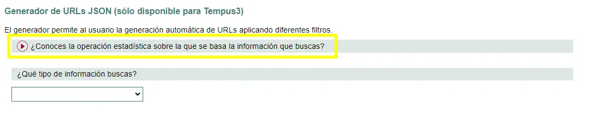
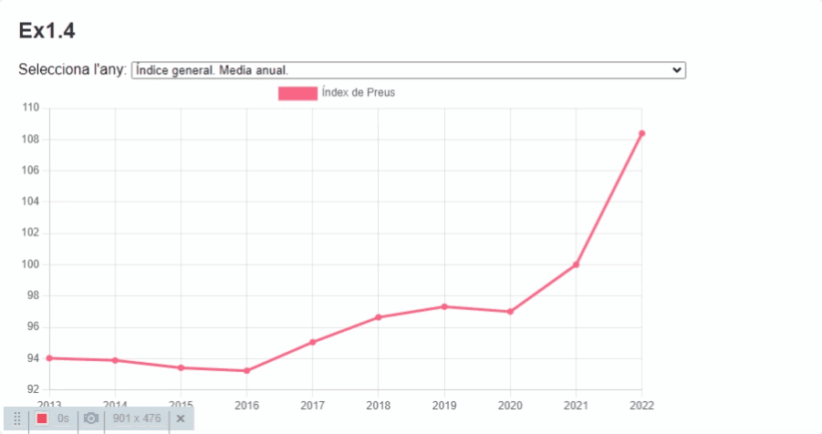

# Ex2 - Institut Nacional d'Estadística

## Enunciat

L'Institut Nacional d'Estadística (INE) és els responsable de la recollida de dades estadístiques a l'estat Espanyol. Aquest proporciona un servei web per a la consulta de dades estadístiques de tot tipus. Ens han demanat que mostrem algunes dades de manera gràfica per obtenir una idea de la situació econòmica actual. 

L'INE proporciona una API REST per a la consulta de dades estadístiques. Aquesta API ens permet obtenir dades en format JSON. Ara bé, la documentació potser no és del tot clara i la quanitat de paràmetres que podem passar a la consulta pot ser bastant gran. Tens una definició de la construcció de URLs a continuació:

[INE API REST - Definició de URLs](https://www.ine.es/dyngs/DataLab/manual.html?cid=47)

Per fer-nos la vida més fàcil, ens proporcionen un generador de URLs JSON d'acord a uns filtres que nosaltres podem aplicar prèviament de manera intuïtiva:

[INE API REST - Generador de URLs](https://www.ine.es/dyngs/DataLab/manual.html?cid=66)

Aquí pots seleccionar primerament el tipus de dada que vols consultar (per exemple, població, PIB, etc.) i després els filtres que vols aplicar a la consulta. A continuacío et detallo els passos a seguir per a obtenir les dades que necessitem. Primer de tot hauràs de mostrar el desplegable un cop facis clic sobre el següent element:



A continuació:

1. **Seleccione una operación estadística:** Llista de les operacions estadístiques disponibles. Per exemple, població, PIB, etc.
2. **Qué tipo de información buscas:** Nosaltres, "Datos de series"
3. **Selecciona una función:** Nosaltres, "Obtener los datos de las series que forman una tabla"
4. **Seleccione una tabla:** Aqui surten totes les taules disponibles per a la operació estadística seleccionada. A continuació veurem quines taules necessitem. 

Per exemple si comences a filtrar per "Cifras de Población" podras arribar a obtenir la informació d'una taula anomenada "Población residente por fecha, sexo y edad" com veus a la imatge:


Finalment un cop tens seleccionada la taula pots triar si vols recuperar una quantitat de períodes o un rang de dates. Seguint amb l'exemple anterior, si jo vull recuperar les dades dels darrers 10 períodes (en aquest cas seran anys), escric "10" a "Cantidad de Periodos" i faig click a **Generar petición**. Voilà! Això ens genera una URL:

> https://servicios.ine.es/wstempus/js/ES/DATOS_TABLA/48852?nult=10

Si la consultes veuràs que aquesta URL et retornarà les dades en format JSON com aquest:

```json
[{"COD":"CP499994", "Nombre":"Todas las edades. Balears, Illes. Total. Población. Número. ", "FK_Unidad":3, "FK_Escala":1, "Data":[{"Fecha":1656626400000, "FK_TipoDato":2, "FK_Periodo":27, "Anyo":2022, "Valor":1232270.406475, "Secreto":false}
,{"Fecha":1640991600000, "FK_TipoDato":1, "FK_Periodo":26, "Anyo":2022, "Valor":1223979.928078, "Secreto":false}
,{"Fecha":1625090400000, "FK_TipoDato":1, "FK_Periodo":27, "Anyo":2021, "Valor":1219378.543835, "Secreto":false}
,{"Fecha":1609455600000, "FK_TipoDato":1, "FK_Periodo":26, "Anyo":2021, "Valor":1219774.93958, "Secreto":false}
,{"Fecha":1593554400000, "FK_TipoDato":1, "FK_Periodo":27, "Anyo":2020, "Valor":1215102.752525, "Secreto":false}
,{"Fecha":1577833200000, "FK_TipoDato":1, "FK_Periodo":26, "Anyo":2020, "Valor":1210724.905461, "Secreto":false}
,{"Fecha":1561932000000, "FK_TipoDato":1, "FK_Periodo":27, "Anyo":2019, "Valor":1198080.867286, "Secreto":false}
,{"Fecha":1546297200000, "FK_TipoDato":1, "FK_Periodo":26, "Anyo":2019, "Valor":1188220.249105, "Secreto":false}
,{"Fecha":1530396000000, "FK_TipoDato":1, "FK_Periodo":27, "Anyo":2018, "Valor":1175744.983836, "Secreto":false}
,{"Fecha":1514761200000, "FK_TipoDato":1, "FK_Periodo":26, "Anyo":2018, "Valor":1166923.27856, "Secreto":false}
]
...
```
Anem doncs a veure si ens en sortim! 

### Ex1 Peticions a l'API

Implementa una funció `getData` encarregada de fer les peticions a l'API de l'INE. Aquesta funció rebrà ja directament la URL generada pel generador de URLs de l'INE i retornarà una Promise amb les dades en format JSON. Aquesta serà la funció a la que farem les crides per obtenir les dades de l'INE.

Comprova que la funció funciona correctament fent una crida a la funció `getData` amb la URL que hem generat anteriorment i fes que es mostri el resultat per consola un cop s'ha resolt la promesa. 

Implementa també la gestió d'errors de manera que si la petició no s'ha pogut realitzar, es mostri un missatge l'error HTTP que s'ha produït.

### Ex2 Preus dels lloguers

Anem a recuperar i mostrar les dades dels preus dels lloguers a Espanya i a Catalunya. Filtra la informació de la taula "Índice de Precios de Alquiler de Vivienda" per a obtenir finalment les dades de la taula **Índices nacionales y por comunidades autónomas: general y por tamaño de la vivienda**.

Implementa la funció `getRentPrices` que obtingui de la URL generada dels últims 10 períodes (això ho generes a traves de la pàgina de l'INE direcgtament). Hauràs de fer servir `getData()`. Mira de fer-ho amb lògica **async/await** i tracta els errors de manera correcta (try/catch). En cas de no poder obtenir les dades, a més de mostrar l'error, hauries de retornar un array buit.

Torna a comprovar que la funció funciona correctament fent una crida a la funció `getRentPrices` amb la URL que hem generat anteriorment i fes que es mostri el resultat per consola un cop s'ha resolt la promesa.

### Ex3 Mostrar les dades

Anem a filtrar i mostrar algunes dades de les que obtenim amb la funció anterior. Si inspecciones les dades que reps, veuràs que tens informació per a cada comunitat autònoma. Existeixen diverses dades ja que es contempla cada comunitat autònoma, el tamany de la vivenda i per cadascuna d'aquestes variants trobes l'índex de preus i la variació anual. Per no embolicar-nos massa hauries de poder filtrar i mostrar:

- Dades TOTALS per la comunitat autònoma de Catalunya tant "Índice" com "Variación anual". 

Tenint en compte això, crea la funció `showRentPrices` que rebrà les dades de la funció anterior. Pots crear-te un funció `main.js` per gestionar la lògica global de l'exercici.

```javascript
const main = async () => {
    const data = await getRentPrices();
    showRentPrices(data);
    //...
}

main();
```

Aqui ens avancarem a aspectes que veurem més endavant quan fem la gestió del DOM. A través de JS, farem que la informació acabi mostrada en forma de llista no ordenada `ul` dins de cada `div` corresponent. Hauríem d'aconseguir una columna amb la informació de l'índex i una altra amb la variació anual. A continuació tens un exemple de codi per poder crear una llista no ordenada des de JS. Els passos per fer-ho són:

1. Creem un element `ul`
2. Creem un element `li`
3. Afegim el text al `li`
4. Afegim el `li` al `ul`

```javascript
const ul = document.createElement('ul');
const li = document.createElement('li');
li.textContent = 'Item 1';
ul.appendChild(li);
```

En el teu cas, fent servir els coneixements que ja tens de mètodes d'arrays (`map`,`forEach`,`filter`, etc...) hauràs de filtrar les dades per a obtenir les dades de Catalunya i fer que el contingut de cada `li` sigui el corresponent.

### Ex4 Mostrar les dades en forma de gràfic

Anem a jugar amb un altre paràmetre prou interessant, **l'IPC**. Aquest és l'índex de preus de consum, un índicador sobre com evolucionen els preus dels productes i serveis que consumeixen les famílies i que, com ja sabeu, està prou disparat últimament!!! Aquest índex es calcula a partir d'una cistella de productes i serveis que es consideren representatius dels consums habituals. En aquest cas et facilito la URL per a obtenir les dades de l'IPC a nivell estatal dels últims 10 períodes:

> https://servicios.ine.es/wstempus/js/ES/DATOS_TABLA/50934?nult=10

En aquest cas farem farem servir la llibreria [Chart.js](https://www.chartjs.org/). Aquesta llibreria ens permet crear gràfics a partir de dades en format JSON.

Per a fer servir aquesta llibreria primerament hauràs d'afegir-la al teu projecte. De fet ja ho tens fet a través del teu HTML amb un tag `<script>`.

Anem a veure com funciona aquesta llibreria. Primerament necessitem un canvas on dibuixar el gràfic. Aquest canvas el pots crear a través del teu HTML:

```html
<canvas id="myChart" width="700" height="300"></canvas>
```

Ara bé, per a poder dibuixar el gràfic necessitem un context. Aquest context el podem obtenir a través del canvas que acabem de crear:

```javascript
const ctx = document.getElementById('myChart').getContext('2d');
```

Ara que ja tenim el contexte, i en el mateix JS on hem estat treballant fins ara, podem crear el gràfic. Per això necessitem crear una nova instància de la classe `Chart` que ens proporciona la llibreria. Aquesta classe necessita dos paràmetres: el context i un objecte amb la configuració del gràfic. Aquest objecte de configuració és on definirem el tipus de gràfic que volem crear, les dades que volem mostrar, etc. Aquí tens un exemple amb dades estàtiques per veure com funciona:

```javascript
let chart = null; // Declarem una variable global per a guardar el gràfic

const myChart = (labels, data) => {
    console.log(labels, data)
    const ctx = document.getElementById('myChart').getContext('2d');
    if (chart) { // If a chart exists
        chart.destroy(); // Destroy it
    }
    chart = new Chart(ctx, {
        type: 'line',
        data: {
            labels: ['2010', '2011', '2012', '2013', '2014', '2015', '2016'],
            datasets: [{
                label: 'Índex de Preus',
                backgroundColor: 'rgb(255, 99, 132)',
                borderColor: 'rgb(255, 99, 132)',
                data: [100, 102, 103, 105, 106, 108, 110]
            }]
        },
        options: {}
    });
}
``` 

No cal que ens compliquem amb la configuració, però pots canviar alguns paràmetres de manera força intuitiva (et deixo la seva web https://www.chartjs.org/docs/latest/). Aquí hem triat un gràfic de tipus "line" que ja ens va prou bé per veure evolucions temporals. 

Hauràs de cridar aquesta funció `myChart` perquè es mostri passant-li les dades que necessitis.

Com veuràs, **les dades que recuperen mostren l'IPC mostren una mitjana i la variació però també mostren dades per a cada tipus de producte**. L'objectiu seria que poguéssim seleccionar el tipus de producte a través d'un **select** que omplirem de manera dinàmica i que es mostri el gràfic amb les dades corresponents. 

Aqui tornarem a veure alguns aspectes relacionats amb el DOM. Per a poder poblar el selector amb les dades que necessitem, hauràs de crear un element `option` per cada tipus de producte que hi hagi a les dades. A continuació tens un exemple de com crear un element `option` i afegir-lo a un selector `select`:

```javascript
const select = document.getElementById('ipc-selector');
const option = document.createElement('option');
option.textContent = 'Opció 1';
select.appendChild(option);
```

Així doncs, mira de seguier els següents passos:

- Afegir de manera dinàmica a un selector (select) els diferents tipus de IPC calculats. Veuràs que cada propietat "Nombre" és diferent. Hi ha pels aliments, per la vivenda... 

Seguint el patró anterior, crea les funcions `getIPC` i `showIPC(selectedIPC)`.

- `getIPC()`: Aquí tornaràs a fer la petició a `getData()` però aquest cop amb la URL de l'IPC. Un cop ho tinguis hauràs d'actualitzar el selector amb els diferents tipus de IPC disponibles. Pots mirar d'aconseguir deixar únicament la part que canvia i evitar que aparegui "Total Nacional" sempre.  

- `showIPC()` No és necessari que li passis les dades com a paràmetre. Pots cridar la funció getIPC() dins ja que és aquí on pots filtrar la informació. 

- `showIPC()` ha de ser la responsable de cridar a `myChart()`. Segurament el més fàcil és que acabis tenint una funció com la següent `myChart(labels, values)`

- Les dades s'haurien de mostrar en ordre cronològic amb els anys d'esquerra a dreta. A continuació tens una demo de com hauria de quedar:




